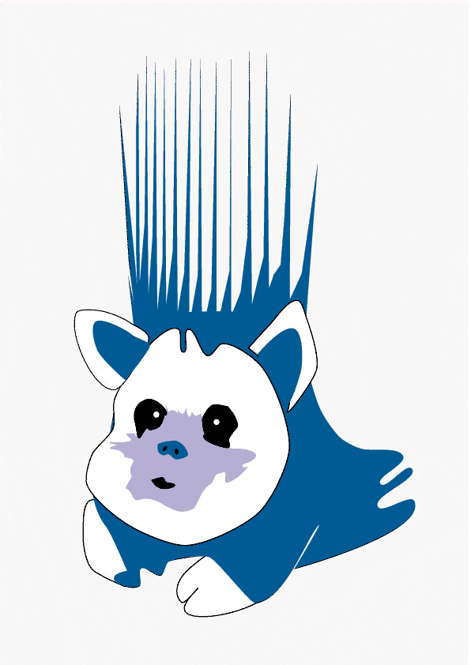

# SNUFA 2026

**Brief summary.** This online workshop brings together researchers in the fields of computational neuroscience, machine learning, and neuromorphic engineering to present their work and discuss ways of translating these findings into a better understanding of neural circuits. Topics include artificial and biologically plausible learning algorithms and the dissection of trained spiking circuits toward understanding neural processing. We have a manageable number of talks with ample time for discussions.

**Program committee.** [Sacha van Albada](https://www.fz-juelich.de/profile/albada_s.van), [Jason Eshraghian](https://ncg.ucsc.edu/jason-eshraghian-bio/), [Dan Goodman](https://neural-reckoning.org), and [Friedemann Zenke](https://zenkelab.org/).

**Quick links.**
<!-- <a href="https://youtube.com/playlist?list=PL09WqqDbQWHEyTZPLMKEi9-RD6kax0tCR&si=Y-sJeZvIn3O062DG">YouTube playlist</a> -->

## Key information

**Workshop**. 4-5 November 2026, European afternoons (online).

**Invited speakers**. 
[Giulia D'Angelo](https://giuliadangelo.github.io/) (Czech Technical University in Prague),
[Eugene Izhikevich](https://www.braincorp.com/team/dr-eugene-izhikevich) (Brain Corp and DeepSpike)

## Format

* Two half days
* 4 invited talks
* 7 contributed talks
* Flash talks by selected poster presenters
* Virtual poster session

<!-- ## Registration

<a href="https://www.eventbrite.co.uk/e/snufa-2026-tickets-1549418545579">Register</a>

Attendance is free, but registration is required (to receive the streaming links). -->

<!-- ## Abstract voting

<a href="https://imperial.eu.qualtrics.com/jfe/form/SV_bKJCYoETdtWGIyG">Vote for your preferred abstracts</a>

Please only vote once !-->

## Abstract submission

**Deadline:** Sept 25, 2026 (anywhere on earth)

<a href="https://forms.cloud.microsoft/e/2z19jyiWqS">Submit abstract</a>

Abstracts will be made publicly available at the end of the abstract submissions deadline for blinded public comments and ratings. We will select the most highly rated abstracts for contributed talks and flash talks, subject to maintaining a balance between the different fields of, broadly speaking, neuroscience, computer science and neuromorphic engineering. Abstracts not selected for a talk, and abstracts selected for a flash talk, will be presented as posters. 

## Agenda

<!-- [Click here for all abstracts](abstracts/index.md). -->

<!--[Click here to open in Google Calendar](https://calendar.google.com/calendar/u/0?cid=OTYzMGJmOWIyZmJjZjNmNjE0ZDMzN2MyZTVmZjhmMWQ0NDYxZTMwYTM3OWNlNmJmZDA5YWVkMzg1MGJlN2IxMUBncm91cC5jYWxlbmRhci5nb29nbGUuY29t) (allows you to add to your own calendar).

[Click here to watch live on Crowdcast](https://www.crowdcast.io/c/snufa-2024).-->

<a href="https://youtube.com/playlist?list=PL09WqqDbQWHEyTZPLMKEi9-RD6kax0tCR&si=Y-sJeZvIn3O062DG">YouTube playlist</a>

| Time (CET) | Session | Local date/time |
|------------|---------|-----------------|
| **November 4th** | | |
| 14:00 | Welcome by the organizers |  |
| | **Session 1** | |
| 14:10 | Invited talk 1 |  |
| 14:55 | Contributed talk 1 |  |
| 15:15 | Contributed talk 2 |  |
| 15:35 | Break |  |
| | **Session 2** | |
| 16:05 | Invited talk 2 |  |
| 16:50 | Contributed talk 3 |  |
| 17:10 | Flash talks by selected poster presenters |  |
| 17:30 | Poster session |  |
| **November 5th** | | |
| 14:00 | Welcome to day 2 |  |
| | **Session 3** | |
| 14:05 | Invited talk 3 |  |
| 14:50 | Contributed talk 4 |  |
| 15:10 | Contributed talk 5 |  |
| 15:30 | Break |  |
| | **Session 4** | |
| 16:00 | Invited talk 4 |  |
| 16:45 | Contributed talk 6 |  |
| 17:05 | Contributed talk 7 |  |
| 17:25 | Closing remarks |  |
