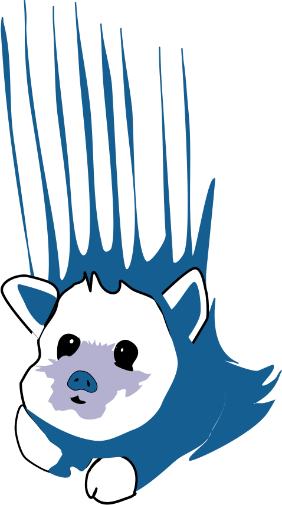

<!-- ## SNUFA -->

SNUFA is an online workshop and community focused on research advances in the field of "Spiking Networks as Universal Function Approximators."

The annual SNUFA online workshop brings together researchers in spiking neural networks to present their work and discuss translating these findings into a better understanding of neural circuits and novel brain-inspired computing approaches. Topics of interest include artificial and biologically plausible learning algorithms and the dissection of trained spiking circuits toward understanding neural processing.

All our previous talks and seminars are available on our [YouTube channel](https://youtube.com/playlist?list=PL09WqqDbQWHFoXyLxIxoblfO7SSQcCAZ-&si=-9I_JYai5MeFaHHK).

[Join our Discord](https://discord.gg/aYvgGakrVK) to chat about this research area, and to get announcements of new papers, conferences, jobs, grant schemes, etc.

<a href="https://youtube.com/playlist?list=PL09WqqDbQWHFoXyLxIxoblfO7SSQcCAZ-&si=-9I_JYai5MeFaHHK">YouTube</a>
<a href="https://discord.gg/aYvgGakrVK">Discord</a>

<!-- SNUFA 2025
----------

The online workshop will likely take place 5-6 November 2025, European afternoons (online).

<a href="https://snufa.net/2025/">Go to SNUFA 2025</a>

The 2025 workshop is being organised by [David Kappel](https://www.ini.rub.de/the_institute/people/david-kappel/), [Julijana Gjorgjieva](https://www.mls.ls.tum.de/compneuro/home/), [Dan Goodman](https://neural-reckoning.org), and [Friedemann Zenke](https://zenkelab.org/). -->

Archive
-------

* [SNUFA 2025](2025).
* [SNUFA 2024](/2024).
* [SNUFA 2023](/2023).
* [SNUFA 2022](/2022).
* [SNUFA 2021](/2021).
* [SNUFA 2020](/2020).

SNUFA logo courtesy of [Skala Art](https://skala-art.net)
