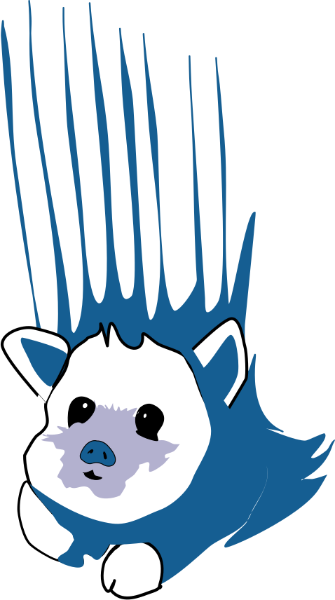

<!-- ## SNUFA -->

SNUFA is an online workshop and community focused on research advances in the field of "Spiking Networks as Universal Function Approximators."

The annual SNUFA online workshop brings together researchers in spiking neural networks to present their work and discuss translating these findings into a better understanding of neural circuits and novel brain-inspired computing approaches. Topics of interest include artificial and biologically plausible learning algorithms and the dissection of trained spiking circuits toward understanding neural processing.

All our previous talks and seminars are available on our [YouTube channel](https://youtube.com/playlist?list=PL09WqqDbQWHFoXyLxIxoblfO7SSQcCAZ-&si=-9I_JYai5MeFaHHK).

[Join our Discord](https://discord.gg/aYvgGakrVK) to chat about this research area, and to get announcements of new papers, conferences, jobs, grant schemes, etc.

<a href="https://youtube.com/playlist?list=PL09WqqDbQWHFoXyLxIxoblfO7SSQcCAZ-&si=-9I_JYai5MeFaHHK">YouTube</a>
<a href="https://discord.gg/aYvgGakrVK">Discord</a>

SNUFA 2026
----------

The online workshop will likely take place 4-5 November 2026, European afternoons (online).

<a href="https://snufa.net/2026/">Go to SNUFA 2026</a>

The 2026 workshop is being organised by 
[Sacha van Albada](https://www.fz-juelich.de/profile/albada_s.van), [Jason Eshraghian](https://ncg.ucsc.edu/jason-eshraghian-bio/), [Dan Goodman](https://neural-reckoning.org), and [Friedemann Zenke](https://zenkelab.org/).

Archive
-------

<ul class="archive-list">

<li><a href="{{ site.baseurl }}/{{ year }}">SNUFA {{ year }}</a></li>

</ul>

SNUFA logo courtesy of [Koshika](https://koshika.net)
